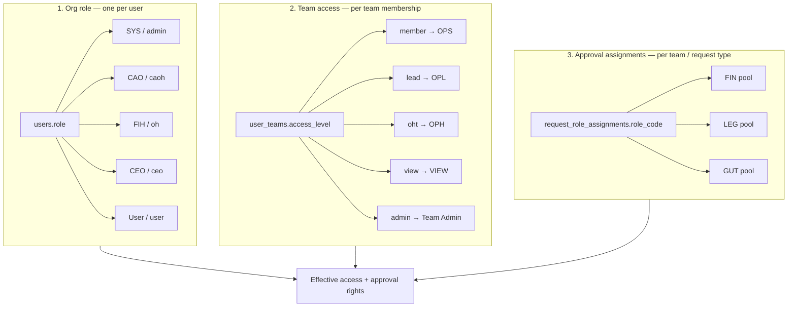

# Roles & Permissions Guide

**Purpose:** Explain how KManager separates **org roles**, **team membership**, and **approval role assignments** — and where to configure each in the app.

**Last updated:** 2026-07-13

**Related docs:**

- [phase-4-signoff.md](./phase-4-signoff.md) — approval platform design
- [phase-5b-role-rename.md](./phase-5b-role-rename.md) — planned DB rename (`member` → `ops`, etc.)

---

## Summary (one paragraph)

KManager uses **three independent layers**. **Org role** (`users.role`) is who someone is **organisation-wide** (SYS, CAO, FIH, CEO, or ordinary User). **Team access** (`user_teams.access_level`) is what they can **do on a specific team** (OPS, OPL, OPH, View, Team Admin). **Role assignments** (`request_role_assignments`) are who can **approve at a workflow step** (FIN, LEG, GUT, etc.) — often several people per role per team. A person’s effective permissions and approval ability come from **all three combined**.

---

## The three layers



---

## Layer 1 — Org role

| What it is | Single value on the **user account** |
| Where stored | `users.role` |
| Where to set | **Admin → Users** (create / edit user) |
| Scope | **Organisation-wide** — not tied to one field team |

### UI labels vs database values

| UI label (Users page) | DB value (`users.role`) | Approval code(s) granted |
|----------------------|-------------------------|---------------------------|
| User | `user` | *(none from org role)* |
| Finance head (FIH) | `oh` | **FIH** |
| Chief admin (CAO) | `caoh` | **CAO**, **FIH** |
| CEO | `ceo` | **CEO** |
| System admin (SYS) | `admin` | **SYS** (+ full app bypass) |

### What org role controls

- **Admin navigation** — SYS, CAO, FIH, CEO see Admin menu items (Users, Teams, Role Assignments, etc.) according to rules in `navPermissions.js`.
- **Break-glass approval** — org admins can act on **other people’s** approval requests (not their own).
- **User management** — who may create/edit users and assign org roles (see `userMgmtAccess.js`).
- **Built-in senior approvers** — CAO/FIH/CEO/SYS map into approval steps without a separate Role Assignment row.

### What org role does **not** include

These are **not** org roles and do **not** appear on the Users page:

| Code | Why not org role |
|------|------------------|
| **OPH** | Team-scoped operations head — set via **Teams** |
| **OPL** | Team lead — set via **Teams** |
| **OPS** | Team member — set via **Teams** |
| **FIN** | Finance reviewer pool — set via **Role Assignments** |
| **LEG / LEH** | Legal workflow — **Role Assignments** |
| **GUT / GUH** | Gurukul / Programs workflow — **Role Assignments** |

---

## Layer 2 — Team access (membership)

| What it is | How a user relates to **each work team** |
| Where stored | `user_teams` (`user_id`, `team_id`, `access_level`) |
| Where to set | **Admin → Teams** → select team → add member or change Access dropdown |
| Scope | **Per team** — same person can be OPL on Team A and OPS on Team B |

### UI labels vs database values

| UI label (Teams page) | DB value (`access_level`) | Display / approval code |
|----------------------|---------------------------|-------------------------|
| View only | `view` | VIEW |
| Member (OPS) | `member` | **OPS** |
| Team lead (OPL) | `lead` | **OPL** |
| Operations head (OPH) | `oht` | **OPH** |
| Team admin | `admin` | Team Admin *(full on that team)* |

> **Important:** The database value for OPH is `oht`, not `oph`. Picking “Operations head (OPH)” in Teams is correct.

### What team access controls

- **Day-to-day app permissions** — buckets, income, expenses, reconcile, transfers, etc. (`state.js` / `computePermissions()`).
- **Team roster** — OPH (`oht`) can manage members on teams they oversee.
- **Approval at OPH / OPL / OPS steps** — when a request’s `current_role_code` is OPH, users with `oht` on **that team** can approve.
- **Personal team** — created automatically when a user is added; separate from work-team membership.

### Typical assignments

| Person | Team access | Meaning |
|--------|-------------|---------|
| Field staff | Member (OPS) | Own buckets, expenses, personal reconcile |
| Team lead | Team lead (OPL) | Operational buckets, submit budgets, team reconcile |
| Regional / ops overseer | Operations head (OPH) | Oversee team, first approval step, manage roster |
| Finance visitor | View only | Read team finance, no writes |

---

## Layer 3 — Approval role assignments

| What it is | Extra **workflow roles** for the approval engine |
| Where stored | `request_role_assignments` |
| Where to set | **Admin → Role Assignments** |
| Scope | Per **user**, optional **team**, optional **request type** |

### Common role codes

| Code | Meaning | Typical use |
|------|---------|-------------|
| **FIN** | Finance reviewer | Budget / recon step after OPH |
| **FIH** | Finance head | Usually from org role `oh`; can also be assigned per team (SYS) |
| **CAO** | Chief approver | Usually from org role `caoh`; can also be assigned (SYS) |
| **LEG** | Legal reviewer | Future legal requests |
| **LEH** | Legal head | Future legal requests |
| **GUT** | Gurukul / Programs reviewer | Future programs requests |
| **GUH** | Gurukul / Programs head | Future programs requests |

### Pool model (multiple people, same role)

- You may assign **many users** the same code (e.g. FIN) for the **same team**.
- When a request waits at **FIN**, **any** assigned FIN user for that team can approve (**first approver wins**).
- This is **data configuration** — no code change per person.
- Assignments are **not** exclusive: one user can be FIN on several teams.

### Optional scoping on assignment

| Field | Empty | Set |
|-------|-------|-----|
| **Team** | Global — all teams (use carefully) | Only that team’s requests |
| **Request type** | All types | e.g. Budget only, Reconciliation only |

---

## How approval resolves “who can act?”

When a request shows **Awaiting FIN** (or OPH, CAO, etc.), the app checks:

1. **Org role** — e.g. `oh` → FIH, `caoh` → CAO + FIH  
2. **Team access on request’s team** — e.g. `oht` → OPH, `lead` → OPL  
3. **Role assignments** — rows in `request_role_assignments` for that `role_code` + team  

Plus:

- **Segregation of duties** — submitter **cannot** approve their own request.  
- **SYS / org admin break-glass** — can act on others’ requests, not own.

Default budget / reconciliation flow:

```text
OPH → FIN → FIH → CAO
```

| Step | Usually configured via |
|------|-------------------------|
| OPH | Teams → Operations head (OPH) |
| FIN | Role Assignments → FIN *(pool)* |
| FIH | Users → Finance head (FIH), or Role Assignments |
| CAO | Users → Chief admin (CAO), or Role Assignments |

---

## Where to configure what (quick reference)

| I need to… | Go to… |
|------------|--------|
| Make someone CAO / FIH / CEO / SYS | **Admin → Users** → org role |
| Put someone on a field team as lead or member | **Admin → Teams** → access level |
| Make someone OPH on a team | **Admin → Teams** → **Operations head (OPH)** |
| Add finance reviewers for Team X | **Admin → Role Assignments** → FIN + team |
| Add 4 legal reviewers (future) | **Admin → Role Assignments** → LEG + team |
| Block login | **Admin → Users** → On hold |
| Change approval **step order** | Database flow tables (`approval_flow_definitions`) — admin UI later |

---

## Common mistakes

| Mistake | Correct approach |
|---------|------------------|
| Setting “OPH” as org role on Users | Use **Teams** → Operations head (`oht`) |
| Expecting FIN on Users page | Use **Role Assignments** |
| One FIN per team only | Assign **multiple** FIN users — any can approve |
| Submitter approving own budget | By design **blocked** — another FIN/OPH must approve |
| Confusing “Submitted” with “Send” | **Submitted** = in queue; approver uses **Approve** to move to next step |

---

## Database reference

| Layer | Table | Key columns |
|-------|--------|-------------|
| Org role | `users` | `role`, `on_hold`, `email`, `name` |
| Team access | `user_teams` | `user_id`, `team_id`, `access_level`, `is_primary` |
| Approval assignment | `request_role_assignments` | `user_id`, `role_code`, `team_id`, `request_type`, `is_active` |
| Approval flow | `approval_flow_definitions` / `approval_flow_steps` | `request_type`, `role_code`, `step_order` |
| In-flight request | `approval_requests` | `current_role_code`, `status`, `team_id` |

Valid `user_teams.access_level` values: `view`, `member`, `lead`, `oht`, `admin` (see migration `024`).

---

## Phase 5B (future)

Today the UI shows **OPS / OPL / OPH** while the database keeps legacy values (`member`, `lead`, `oht`). A later migration will align DB names with display codes. See [phase-5b-role-rename.md](./phase-5b-role-rename.md).

Until then: **always pick roles from the UI dropdowns** — do not type OPH/FIN codes into database fields manually.

---

## Example: onboarding a field team

1. **Users** — create account (org role: **User**).  
2. **Teams** — add to “Mumbai Outreach” as **Team lead (OPL)** or **Member (OPS)**.  
3. **Teams** — assign one overseer as **Operations head (OPH)** on that team.  
4. **Role Assignments** — assign 2–3 finance staff as **FIN** scoped to that team.  
5. Senior approvers — ensure org has **FIH** (`oh`) and **CAO** (`caoh`) users, or assign via Role Assignments.

No single screen defines everything — that is intentional: org identity, team job, and approval duty stay separate.
